# BitCommunity OS - Technical Architecture

**Status:** Prototype / Grant Application  
**Version:** 0.1.0  
**Author:** Dr. Joshua Osunlakin

---

## 1. System Overview

BitCommunity OS is an Event-Driven, Non-Custodial "Social-Fi" platform designed for the Stacks Blockchain. It bridges off-chain social platforms (starting with Discord) with on-chain assets (sBTC, SIP-010, SIP-009) using a "Vault & Operator" pattern.

### Key constraints:
*   **Non-Custodial:** The bot never holds user private keys.
*   **Real-Time:** Relies on Hiro Chainhook for instant event streaming (Nakamoto Release speeds).
*   **Multi-Asset:** Native support for sBTC, STX, and SIP-010 tokens.

---

## 2. Sequence Diagram (The Tipping Flow)

The following diagram illustrates the "Operator Pattern." The user approves an allowance on-chain *once*, and the Bot executes transfers within that limit, paying the STX gas fees on behalf of the user.

```mermaid
sequenceDiagram
    autonumber
    actor UserA as User A (Discord)
    participant Bot as NestJS Backend
    participant DB as Prisma/Postgres
    participant Stacks as Stacks Node (RPC)
    participant Contract as Vault Contract
    participant Chainhook as Hiro Chainhook

    Note over UserA, Bot: Pre-req: User A linked Wallet & Approved Contract

    UserA->>Bot: /tip @UserB 10 sBTC
    
    rect rgb(20, 20, 20)
        Note right of Bot: Validation Phase
        Bot->>DB: Get Wallet for User A & User B
        Bot->>Stacks: (Read-Only) get-allowance(User A)
        Stacks-->>Bot: Returns: 500 sBTC
    end

    alt Allowance Sufficient
        Bot->>Contract: (Tx) transfer-proxy(from=UserA, to=UserB, amt=10)
        Note right of Bot: Bot pays gas, User pays sBTC
        Contract-->>Bot: TxID: 0x123...
        Bot-->>UserA: ⏳ Tip submitted to mempool...
    else Allowance Insufficient
        Bot-->>UserA: ❌ Error: Insufficient Allowance. Please approve more.
    end

    Note over Stacks, Chainhook: Mining (Nakamoto Block ~5s)

    Stacks->>Chainhook: Emits Event: Print(topic="tip", amt=10)
    Chainhook->>Bot: POST /webhooks/chainhook (Event Payload)
    
    rect rgb(20, 20, 20)
        Note right of Bot: Indexing Phase
        Bot->>DB: Update Tip Status -> CONFIRMED
        Bot->>DB: Update User Balances (Cache)
    end
    
    Bot->>UserA: ✅ Tip Confirmed! 10 sBTC sent to @UserB
```



3. Database Schema (Prisma / PostgreSQL)
We utilize a relational schema to handle high-concurrency reads for Token Gating. Wallet balances are cached locally and updated via Chainhook events to prevent rate-limiting on the Stacks Node.

```// schema.prisma
datasource db {
  provider = "postgresql"
  url      = env("DATABASE_URL")
}

model User {
  id              String   @id @default(uuid())
  discordId       String   @unique
  stacksAddress   String?  @unique
  
  // Security: Nonce prevents Replay Attacks during wallet linking
  authNonce       String   @default(uuid()) 
  
  // Relations
  tipsSent        Tip[]    @relation("Sender")
  tipsReceived    Tip[]    @relation("Receiver")
  balances        TokenBalance[] // Cached balances for Gating
  
  createdAt       DateTime @default(now())
  updatedAt       DateTime @updatedAt
}

// --------------------------------------------------------
// COMMUNITY & GATING
// --------------------------------------------------------
model Community {
  id              String   @id @default(uuid())
  discordGuildId  String   @unique
  name            String
  settings        Json     @default("{}") 
  
  roles           RoleRule[]
}

model RoleRule {
  id              String    @id @default(uuid())
  communityId     String
  community       Community @relation(fields: [communityId], references: [id])
  
  discordRoleId   String    // The Role to assign (e.g. "Whale")
  tokenContract   String    // SIP-010 Principal
  minAmount       Decimal   // e.g. 100.00
  
  @@unique([communityId, discordRoleId, tokenContract])
}

// --------------------------------------------------------
// FINANCIALS & INDEXING
// --------------------------------------------------------
model Tip {
  id              String   @id @default(uuid())
  txHash          String?  @unique
  amount          Decimal
  tokenContract   String   
  
  senderId        String
  sender          User     @relation("Sender", fields: [senderId], references: [id])
  receiverId      String
  receiver        User     @relation("Receiver", fields: [receiverId], references: [id])
  
  status          TipStatus @default(PENDING)
  createdAt       DateTime  @default(now())
}

model TokenBalance {
  id              String   @id @default(uuid())
  userId          String
  user            User     @relation(fields: [userId], references: [id])
  
  tokenContract   String
  balance         Decimal  @default(0)
  allowance       Decimal  @default(0) // Tracks authorized spend limit
  
  lastUpdated     DateTime @updatedAt
  @@unique([userId, tokenContract])
}

enum TipStatus {
  PENDING
  SUBMITTED
  CONFIRMED
  FAILED
}
```

**4. API Specifications (NestJS):**
The backend exposes a modular REST API to handle off-chain logic and blockchain synchronization.

**Auth Module (`/api/auth`)**

- **GET /nonce:** Generates a session nonce for wallet signing.
- **POST /verify:** Validates SIP-018 signatures to securely link a Stacks Wallet to a Discord ID.

**Tipping Module (`/api/tipping`)**

- **GET /allowance/:userId:** Performs a read-only contract call to check **vault.clar** limits.
- **POST /execute:**
    - Validates Sender Balance > Tip Amount.
    - Validates Allowance > Tip Amount.
    - Constructs and signs the transaction using the **Operator Hot Wallet** (paying STX gas).
    - Broadcasts to Stacks Mainnet.

**Webhook Module (`/api/webhooks`)**

- **POST /chainhook:** Ingests signed payloads from Hiro Chainhook.
    - _ft\_transfer\_event_: Updates **TokenBalance** cache.
    - _print\_event_: Confirms Tip status and triggers Discord notifications.


5. Security Model
Zero Custody: The platform does not hold user funds. Funds sit in the Vault contract or the User's wallet.
Allowance Pattern: Users must explicitly approve the contract to spend a specific amount. This limits the "blast radius" of any potential compromise to the approved daily limit.
Operator Isolation: The Bot wallet only holds STX for gas fees. It has no authority to withdraw funds to arbitrary addresses, only to execute transfers between whitelisted users.